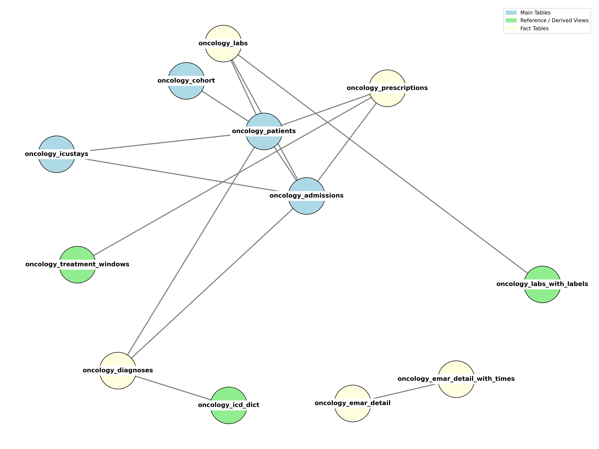

Bridging Clinical and Genomic Data in Cancer Patients

## Overview & Workflow

This project comprises a **curated, oncology-focused relational dataset** derived from the [MIMIC-IV v3.1 clinical database](https://mimic.physionet.org/), one of the largest publicly available medical datasets that encompass detailed patient-level information at the Beth Israel Deaconess Medical Center. It isolates and structures information relevant to **cancer patients** to support downstream analysis, visualization, or machine learning workflows, and serves as a foundation for bridging clinical data (MIMIC-IV) with molecular profiles (e.g., TCGA).

- Extracted key tables from MIMIC-IV (`patients`, `admissions`, `diagnoses_icd`, `icustays`, `prescriptions`, `labevents`) in a local **PostgreSQL** setup  
- Filtered all data to focus on oncology-relevant fields:
  - **Diagnoses** using cancer-related ICD-9 (140–239) and ICD-10 (C00–D49) codes
  - **Lab values** including blood counts, liver enzymes, and tumor markers
  - **Medications** relevant to chemotherapy, immunotherapy, or hormonal therapy  
- Defined a **derived oncology cohort** for efficient filtering based on ICD logic  
- Built supporting views for treatment timelines and labeled lab test values  
- Optimized for efficient querying via indexes and materialized views

---

## Metadata

- **Source**: [MIMIC-IV v3.1](https://doi.org/10.13026/kpb9-mt58)
- **Institution**: Beth Israel Deaconess Medical Center (2008–2022)
- **Modules Used**: `hosp`, `icu`
- **Programming**: PostgreSQL, Python (ETL), SQL (views/indexes)
- **Focus**: Oncology-relevant EHR subset
- **Derived From**: Diagnoses, labs, prescriptions, ICU stays
- **Primary Cohort Definition**: Patients with ICD-9/10 neoplasm codes
- **Compliance**: PhysioNet DUA 1.5.0, HIPAA-deidentified, time-shifted

---

## Core Schema Structure

The dataset is structured using 3 broad types of tables:

| Category              | Description                                                                 | Examples |
|----------------------|-----------------------------------------------------------------------------|----------|
| **Main Tables**       | Core entities: patient demographics, admissions, ICU stays, cohort flag     | `oncology_patients`, `oncology_admissions`, `oncology_icustays`, `oncology_cohort` |
| **Fact Tables**       | Event-level records: diagnoses, labs, prescriptions, EMAR (med admin records) | `oncology_diagnoses`, `oncology_labs`, `oncology_prescriptions`, `oncology_emar_detail` |
| **Reference Tables**  | Dictionaries or derived views for enrichment or summarization                | `oncology_icd_dict`, `oncology_labs_with_labels`, `oncology_emar_detail_with_times`, `oncology_treatment_windows` |

---

Visual representation of the schema:

---

## Use Cases

- Track cancer patients longitudinally (lab values, medications, ICU stays)
- Model treatment response or outcomes
- Build dashboards or visualizations for clinical metrics
- Practice clinical data engineering and SQL workflows
- Integrate with genomics registries (e.g. TCGA) for multimodal analysis

---

## Compliance and Licensing

This project is a derived work from the MIMIC-IV v3.1 dataset and adheres strictly to the PhysioNet Credentialed Health Data Use Agreement (DUA) 1.5.0:

- All data remains HIPAA-deidentified and **time-shifted**
- No attempt has been made to reverse date shifting or re-identify patients
- Derived tables and cohorts are used for **research and development only**
- Any downstream use must also comply with the original license terms

If this dataset or associated resources are shared publicly, they will be submitted to [PhysioNet](https://physionet.org/about/submissions/) under the same license and access control as the source data.

---

## Citations

If you use this project or data derived from it, please cite the following:

**MIMIC-IV v3.1 Dataset**  
> Johnson, A., Bulgarelli, L., Pollard, T., Gow, B., Moody, B., Horng, S., Celi, L. A., & Mark, R. (2024). MIMIC-IV (version 3.1). PhysioNet. https://doi.org/10.13026/kpb9-mt58

**Original MIMIC-IV Publication**  
> Johnson, A.E.W., Bulgarelli, L., Shen, L., et al. (2023). MIMIC-IV, a freely accessible electronic health record dataset. *Scientific Data*, 10, 1. https://doi.org/10.1038/s41597-022-01899-x

**PhysioNet Reference**  
> Goldberger, A.L., Amaral, L.A.N., Glass, L., et al. (2000). PhysioBank, PhysioToolkit, and PhysioNet: Components of a new research resource for complex physiologic signals. *Circulation*, 101(23), e215–e220.

---

## Submission

This derived dataset and documentation will be made available via PhysioNet under the “MIMIC-IV” parent project. It will carry the title `MIMIC-IV-Ext-OncoTCGA` and follow all required licensing and credentialing restrictions.

---
