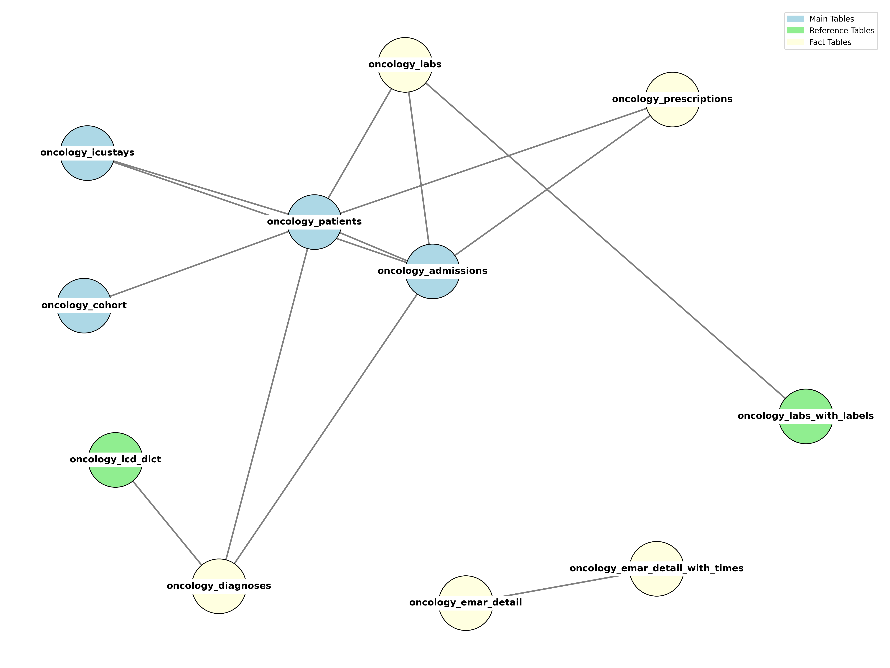

# Oncology Subset of MIMIC-IV

This project comprises a **curated, oncology-focused relational dataset** from the [MIMIC-IV clinical database](https://mimic.physionet.org/). It isolates and structures information relevant to **cancer patients** to support downstream analysis, visualization, or machine learning workflows.

---

## Overview

- Extracted key tables from MIMIC-IV (patients, admissions, diagnoses, ICU stays, prescriptions, labs) in a local **PostgreSQL** setup.
- Filtered all data to focus on oncology-relevant fields:
  - **Diagnoses** with cancer-related ICD-10 codes.
  - **Lab values** (blood counts, liver enzymes, tumor markers).
  - **Medications** relevant to chemotherapy or immunotherapy.
- Defined a **derived oncology cohort** for fast patient filtering.
- Created materialized views and structured schema for efficient queries.

---

## Schema Structure

The dataset is structured using 3 broad types of tables:

| Category        | Description                                                                            | Examples |
|-----------------|----------------------------------------------------------------------------------------|----------|
| **Main Tables** | Core entities: patient demographics, admissions, ICU stays, cohort flag.              | `oncology_patients`, `oncology_admissions` |
| **Fact Tables** | Event-level records: diagnoses, labs, prescriptions, EMAR (med admin records).         | `oncology_labs`, `oncology_prescriptions` |
| **Reference Tables** | Dictionaries or labels for codes (ICD, lab tests).                               | `oncology_icd_dict`, `oncology_labs_with_labels` |

Visual representation of the schema:

---

## Use Cases

- Track cancer patients longitudinally (lab values, medications, ICU stays)
- Model treatment response or outcomes
- Build dashboards or visualizations for clinical metrics
- Practice clinical data engineering and SQL workflows

